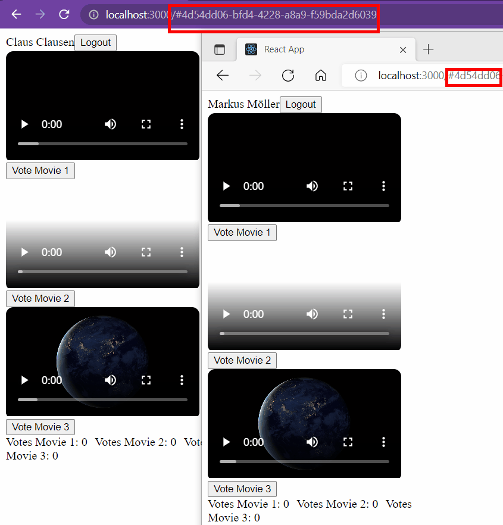

# Fluid Framework - Vote Movie

Small demo standalone app letting users vote for a movie while results are synced over different clients with Microsoft's fluid Framework.

Before user login nothing is rendered:


After login and established container movies (and potential existing votes)are rendered:


In action while two browser clients syncing:



For further details see the author's [blog post](https://mmsharepoint.wordpress.com/2022/06/04/fluidframework-and-azure-fluid-relay-service/)

Challenge also described with a Microsoft Teams app in a former [blog post](https://mmsharepoint.wordpress.com/2022/05/26/teams-meeting-apps-a-sample-for-in-meeting-experience-and-stageview-vote-movies/)

## Prerequisites

* [Node.js](https://nodejs.org) version 14.7.5 or higher

    ```bash
    # determine node version
    node --version
    ```

## Version history

Version|Date|Author|Comments
-------|----|----|--------
1.0|Jun 01, 2022|[Markus Moeller](https://twitter.com/moeller2_0)|Initial release
1.1|Jun 20, 2022|[Markus Moeller](https://twitter.com/moeller2_0)|Azure Fluid Relay added

## Disclaimer

**THIS CODE IS PROVIDED *AS IS* WITHOUT WARRANTY OF ANY KIND, EITHER EXPRESS OR IMPLIED, INCLUDING ANY IMPLIED WARRANTIES OF FITNESS FOR A PARTICULAR PURPOSE, MERCHANTABILITY, OR NON-INFRINGEMENT.**

## Minimal Path to Awesome
- Clone the repository
    ```bash
    git clone https://github.com/mmsharepoint/fluid-vote-movie.git
    ```
- Adjust code to only use InsecureTokenProvider OR
- Deploy and configure parallel Azure Function acting as a token provider: https://github.com/mmsharepoint/fluid-vote-movie-tokenprovider 
- Put AppID and other relevant parameters to local .env (derive it from .env-sample)
- In TWO consoles, navigate to `/fluid-vote-movie`

    ```bash
    cd fluid-vote-movie
    ```

- Install modules once

    ```bash
    npm install
    ```
- In one console start TinyliciousClient
    ```bash
    npx tinylicious
    ```
- In other console start app
    ```bash
    npm run start
    ```

- Click the app's Voe buttons
- Copy url and open 2nd app instance in different browser (tab)
  - See votes synced
- Open another app by removing the hash (#) from url
  - See votes re-initialized

## Features

This is a standalone web app to show usage of Microsoft's Fluid Framework
* Render video files with React and HTML5
* Instantiate a Fluid Framework container
* Sync runtime values over different clients
* Use Azure Fluid Relay service as enterprise resource for data container storage

## Useful links
[Microsoft's Fluid Framework](https://fluidframework.com/?WT.mc_id=M365-MVP-5004617)
[Microsoft Azure Fluid Relay service](https://azure.microsoft.com/en-us/services/fluid-relay?WT.mc_id=M365-MVP-5004617)